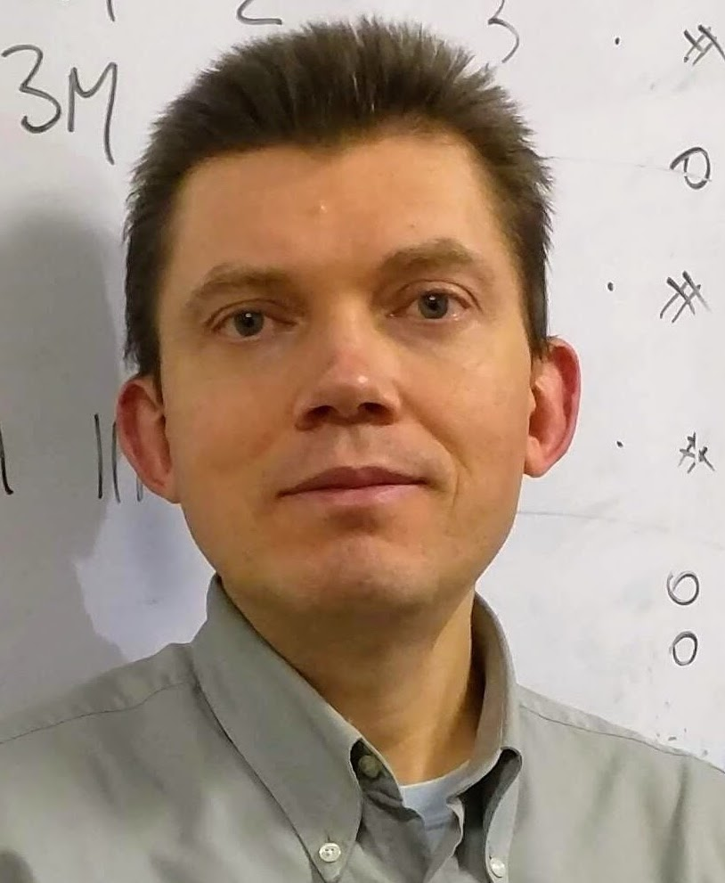
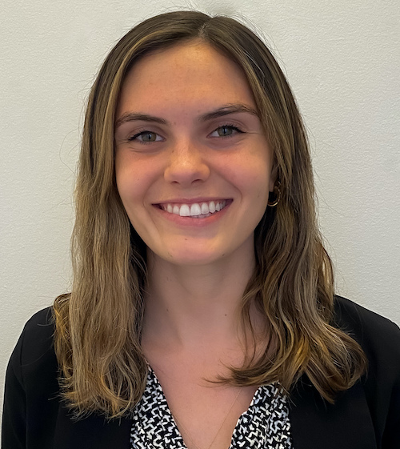
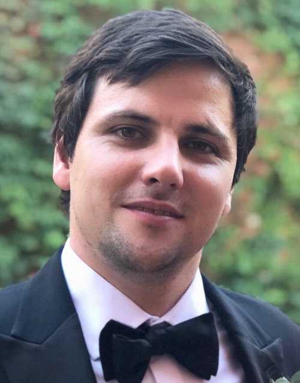
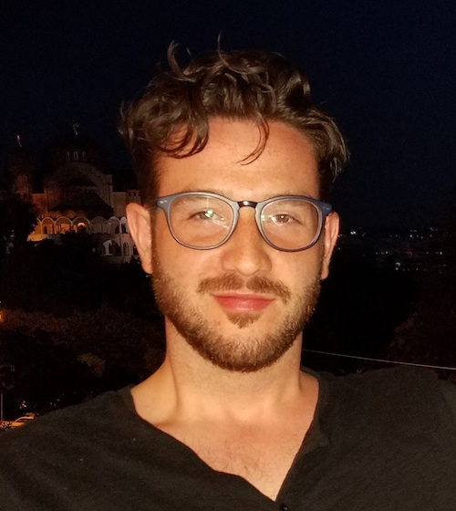
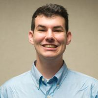



&nbsp;&nbsp;&nbsp;Mikhail Dozmorov, Ph.D., Blick Scholar  
&nbsp;&nbsp;&nbsp;Associate Professor, [Department of Biostatistics](https://biostatistics.vcu.edu/)  
&nbsp;&nbsp;&nbsp;Affiliate, [Department of Pathology](https://pathology.vcu.edu/)  
&nbsp;&nbsp;&nbsp;Virginia Commonwealth University  
<!-- &nbsp;&nbsp;&nbsp;[CV](./files/Dozmorov_M-CV.pdf) -->  
&nbsp;&nbsp;&nbsp;Twitter: [@mikhaildozmorov](https://twitter.com/mikhaildozmorov) |
GitHub: [mdozmorov](https://github.com/mdozmorov) | [Google Scholar](http://scholar.google.com/citations?user=soABR8sAAAAJ&hl=en) | [ORCID](https://orcid.org/0000-0002-0086-8358) | [LinkedIn](http://www.linkedin.com/in/dozmorov/) | [Faculty profile](https://medschool.vcu.edu/expertise/detail.html?id=mdozmorov)
 
 

&nbsp;&nbsp;&nbsp;Maggie Marshall, M.S. Bioinformatics student  
&nbsp;&nbsp;&nbsp;Senior Research Assistant, 2020-present  
 
&nbsp;&nbsp;&nbsp;GitHub: [magmarshh](https://github.com/magmarshh)   
 
 
 

## Alumni

&nbsp;&nbsp;&nbsp;Tyler Steele, Ph.D.  
&nbsp;&nbsp;&nbsp;Former postdoctoral Fellow, 2020-2021  
 
&nbsp;&nbsp;&nbsp;GitHub: [twesteele](https://github.com/twesteele)   
 
 
 

&nbsp;&nbsp;&nbsp;Spiro Stilianoudakis, Ph.D.   
&nbsp;&nbsp;&nbsp;Former graduate student, 2017-2021  
&nbsp;&nbsp;&nbsp;First job: Scientist at Procter & Gamble  
 
&nbsp;&nbsp;&nbsp;GitHub: [stilianoudakis](https://github.com/stilianoudakis)   
 
 
 

&nbsp;&nbsp;&nbsp;Katarzyna Tyc, Ph.D.  
&nbsp;&nbsp;&nbsp;Former postdoctoral Fellow, 2019-2020  
&nbsp;&nbsp;&nbsp;Current: Senior Research Scientist, [Massey Cancer Center](https://www.massey.vcu.edu/)  
 
&nbsp;&nbsp;&nbsp;GitHub: [kmt555](https://github.com/kmt555) | [Google Scholar](https://scholar.google.com/citations?user=IrDcxXMAAAAJ&hl=en&oi=sra) | [LinkedIn](https://www.linkedin.com/in/katarzynatyc/)   
 
 

&nbsp;&nbsp;&nbsp;Kellen Cresswell, Ph.D.  
&nbsp;&nbsp;&nbsp;Former graduate student, 2015-2019  
&nbsp;&nbsp;&nbsp;First job: Scientist at Procter & Gamble  
 
&nbsp;&nbsp;&nbsp;GitHub: [cresswellkg](https://github.com/cresswellkg) | [LinkedIn](https://www.linkedin.com/in/kellen-cresswell/)  
 
 

&nbsp;&nbsp;&nbsp;John Stansfield, Ph.D.  
&nbsp;&nbsp;&nbsp;Former graduate student, 2015-2019  
&nbsp;&nbsp;&nbsp;First job: Manager Nonclinical Biostatistics - Early Clinical Development at Pfizer  
 
&nbsp;&nbsp;&nbsp;GitHub: [jstansfield0](https://github.com/jstansfield0) | [LinkedIn](https://www.linkedin.com/in/john-stansfield-4a660a179/)  
 
 

&nbsp;&nbsp;&nbsp;Edmund Glass, Ph.D.  
&nbsp;&nbsp;&nbsp;Former graduate student, 2014-2016  
&nbsp;&nbsp;&nbsp;First job: Scientist at PharPoint Research Inc.  
 
&nbsp;&nbsp;&nbsp;GitHub: [ERGlass](https://github.com/ERGlass) | [LinkedIn](https://www.linkedin.com/in/edmundglass/)  
 
 

